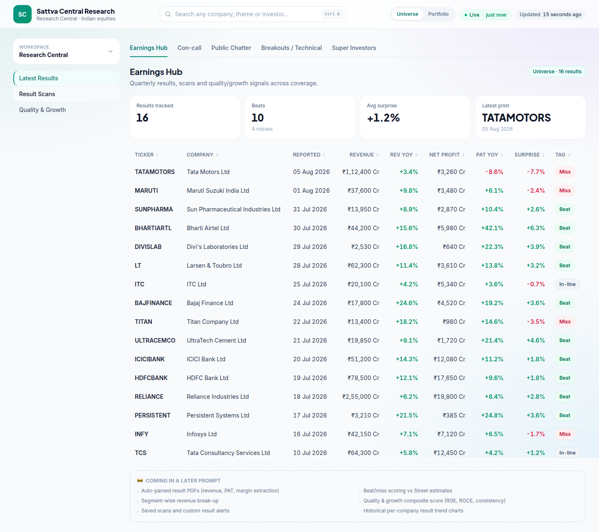
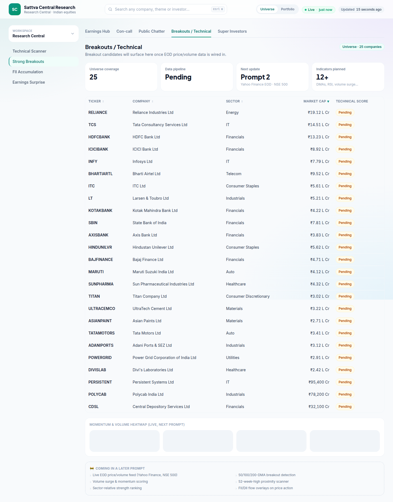
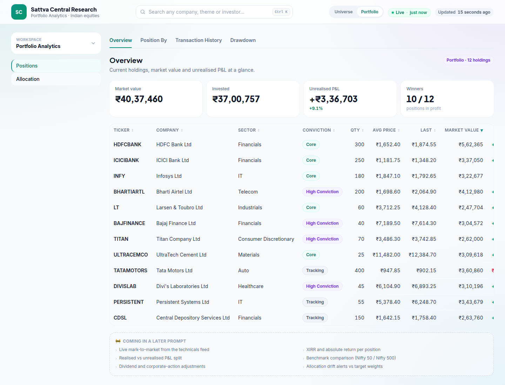

# Sattva Central Research

An Indian-equities research and portfolio analytics dashboard. Two workspaces —
**Research Central** (earnings, con-calls, public chatter, technical breakouts, superstar
investors) and **Portfolio Analytics** (positions, allocation, transactions, drawdown) — with a
global Portfolio ⇄ Universe scope toggle that applies to every tab.

Static site, no build step, no bundler, no framework, no npm dependencies for the app itself.
Vanilla ES modules and Tailwind from a CDN. Hosted as a Cloudflare Worker.



---

## Status

**Prompt 1 of 7 — foundation and UI shell.** The navigation model, routing, design system,
UI primitives, live-update engine and mock data are in place; every tab renders a real,
presentable placeholder panel. The internals of each tab land one prompt at a time — see the
roadmap in [`docs/SPEC.md`](docs/SPEC.md#8-roadmap).

All data under `public/data/mock/` is placeholder. The one genuinely live feed,
`public/data/technicals.json`, arrives in prompt 2 — the Technical Scanner and Strong Breakouts
sub-views show an honest "Pending" state until then rather than invented indicator values.

---

## Run it locally

No install step. Serve `public/` over HTTP with anything:

```bash
python3 -m http.server 8080 -d public
# then open http://localhost:8080
```

Opening `public/index.html` directly from the filesystem will **not** work — `fetch()` of the
JSON data files is blocked on `file://`. The app detects this and says so.

Optionally, run it through the real Worker runtime:

```bash
npx wrangler dev
```

---

## Deploy

Cloudflare Workers, with the static site served through the `ASSETS` binding:

```bash
npx wrangler deploy
```

Config lives in [`wrangler.jsonc`](wrangler.jsonc); the Worker itself is
[`worker/index.js`](worker/index.js), which serves assets for everything and has a clearly
marked slot for future `/api/*` routes.

---

## Layout

```
public/
  index.html          design tokens, fonts, Tailwind CDN
  js/
    app.js            bootstrap: load JSON, mount the shell
    core/             state, router, live engine, format, dom helpers
    ui/               components.js (primitives), shell.js (chrome + tab registry)
    tabs/             earnings-hub, concall, public-chatter, breakouts, super-investors
    portfolio/        overview, position-by, transactions, drawdown
  data/               portfolio.json, universe.json, mock/*.json
worker/index.js       asset serving + /api/* slot
docs/SPEC.md          product spec, nav model, per-tab features, 7-prompt roadmap
docs/DATA-CONTRACTS.md  every JSON file: shape, types, units, cadence, real source
CLAUDE.md             working rules, module contract, design tokens, where-to-look index
```

---

## Docs

- **[`docs/SPEC.md`](docs/SPEC.md)** — the product spec: navigation model, scope toggle, every
  tab and sub-view with its planned features, and the 7-prompt roadmap.
- **[`docs/DATA-CONTRACTS.md`](docs/DATA-CONTRACTS.md)** — every data file's exact JSON shape,
  field types, units, refresh cadence and intended real source. Read this before wiring live data.
- **[`CLAUDE.md`](CLAUDE.md)** — stack rules, file layout, the module interface contract, design
  tokens, and the verification checklist.

## Screenshots

| Breakouts / Technical | Portfolio Overview |
| --- | --- |
|  |  |
